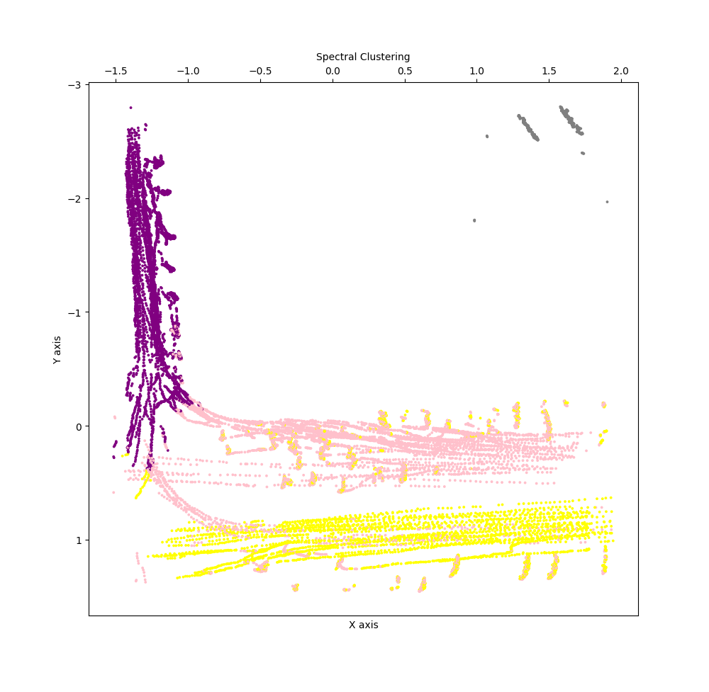

# Measuring Traffic Flow Using Deep Neural Networks and Machine Learning Algorithms
In this project we use deep neural networks and image processing algorithms such as Faster R-CNN and YOLO for detecting vehicles from aerial imagery. After we trained our neural network, we have used DeepSort algorithm for tracking vehicles and after that we used Support Vector Machine (SVM) algorithm for separating road lines from each other for further use in national AE project that measures traffic flow through monitoring cameras installed at the junctions in the Tehran city in Iran.

# Getting Started

This project is developed in 4 stages. I have used tensorflow framework and YOLOv4 for developing car detection applcation

**Note: The uploaded codes are not modular yet and they are only for testing.**

## Requirements
on Ubuntu 20.04 :
`pip3 install -r requirements.txt`
`pip3 install -r requirements.txt`
    
## Stage 1 : detecting and tracking cars from aerial imagery

We have trained YOLOv4 model for dettecting cars from aerial images with a created and modified dataset. After we trained our custom neural netwoork dataset, we use DeepSort algorithm for tracking cars. For converting YOLOv4 model to a tensorflow model we have to use codes blow in Ubuntu Terminal:

`python3 save_model.py --model yolov4 `

**Note: My YOLOv4 model has been uploaded [Here](https://doc-08-84-docs.googleusercontent.com/docs/securesc/20suh9go1v3vlarroa5dsp4m809n4rbh/3ssikq7biincudege1abqb60la8oqrop/1623158550000/15400991575326207325/15400991575326207325/1krNerPoMZfPJXf-a9rgNXEILY0201gex?e=download&authuser=0&nonce=0761t5u6j0802&user=15400991575326207325&hash=6jfus4akvt3gkj2284m9bdd373df5l83)**

For tracking cars we use this code on Ubuntu Terminal:

`python3 object_tracker.py`

You have determine specific arguments define in this code. After running this code it will create a table of different deature in cars in 'data.pkl' file. It is a dictionary that containing location of every cars in every frames.

## Demo of Object Tracker on Persons

## Stage 2 : clustering lines with features exttracted in the first stage

In this stage we will use features extracted in the first stage to cluster cars. This method is a semi-supervised algorithm. We only determine the number of clusters and it will use the features below to cluster cars in different cars:

1. Horizonal position of cars

2. Vertical position of cars

3. Angle of cars

**Note: All features have been normalized for improving accuracy and speed of this application

Because of the lack of cars in single pair of frames, we had to use 1000 frames and 60000 cars feature for clustering and determining lines. After trying lots of clustering algorithms, we have got the best results with spectral clustering. All feature have been implanted in Pandas dataframes and have been saved as .csv files. we run this code on Ubuntu terminal:

`python3 line detection.py`

As we can see in the figure above, there are lots of erros in this method so we have to use another algorithms to improve our accuracy. This stage will save the clustering model as a pickle file. We use tis model to train a SVM model in stage 3.

## Stage 3 : Training SVM on Labeled data

In the stage two we had huge erros that we had to fix. For improving accuracy we have trained a Support Vector Machine with a RBF kernel to classify different lines. For labeling cars we had used the clustering model extracted in the stage two. 

So, we had fixed many errors. Like the stage two we will save our model as a pickle file after running this code:

`python3 line_classification.py`

## Stage 4 : Running a second-to-second video analysis

In this stage we use all four models extracted above for visualising a second-to-second video analysing application. For running this code we have to use:

`python3 main.py`

We have used opencv to put text on each line. Also, we have calculated average speed of every cars in every lines. with this application we can control all traffic lights.

**Note: If you don't delete your app, charges for the use of DigitalOcean services will continue to accrue.**
